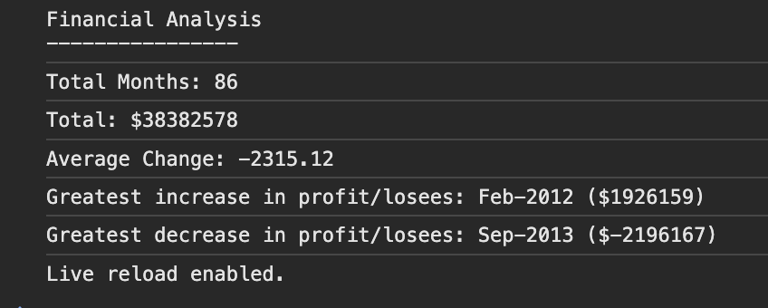
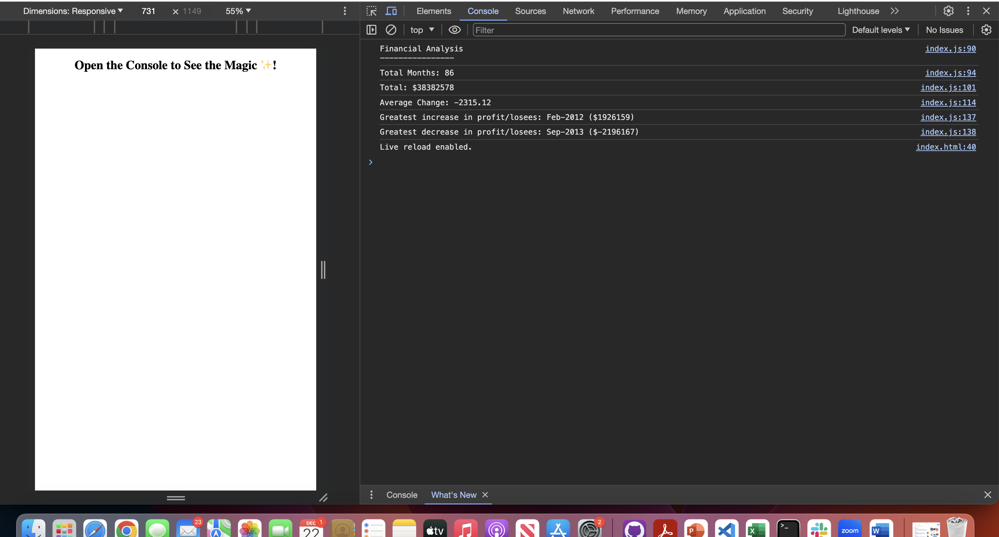

# Console-Finances

Finalncial Analysis through coding in javascript

## Description

The aim of this project was to write code to solve a real world scenario through basic knowledge of javascript. 
The code was to analyse financial data provided in a data set and calculate various required values in profits and losses over a period of a months.

Version control was through git and the updated repository can be found at:

https://github.com/ShaliniSunkuru/Console-Finances 

## Table of Contents

- User Story
- Acceptance Critera
- Screenshot
- Technology Used
- Deployment
- Usage

## User Story

AS a company
I WANT to see my financial data on the console 
SO THAT financial calculations are automated through javascript and easily viewable on the console

## Acceptance Criteria

GIVEN a data set of arrays comprising month and corresponding profit/loss
WHEN I go on to the console
I should be able to view a clear heading: Financial Analysis
WhEN I read further
I see the total number of months, 
I see the total amount of profit/loss
I see the average change in profit/loss over the months
I see the month and the amount of the greatest increase in profit/loss
I see the month and the amount of the greatest decrease in profit/loss

## Screenshot

Here is a screenshot of the data displayed on the console.

## Technology Used

The following tools and technologies were used in this project

- HTML5
- Javascript
- Visual Studio Code
- GIT
- Github
  
## Deployment

Here is a link to the deployed project.

https://shalinisunkuru.github.io/Console-Finances/ 

## Usage

Click on the url for the deployed project. 
Navigate to the developer tools by right-clicking and clicking on Inspect. 
Select the Console tab.
You should be able to view the details of Financial Analysis similar to the screenshot.

## Credits

I appreciate the guidance of the instrutor and TAs of edX Bootcamp. W3Schools, and stack overflow have been a great help in grasping the concepts of javascript and the Math class which has been extensively used for this project.

## License

Please refer to the MIT License in the repository.

